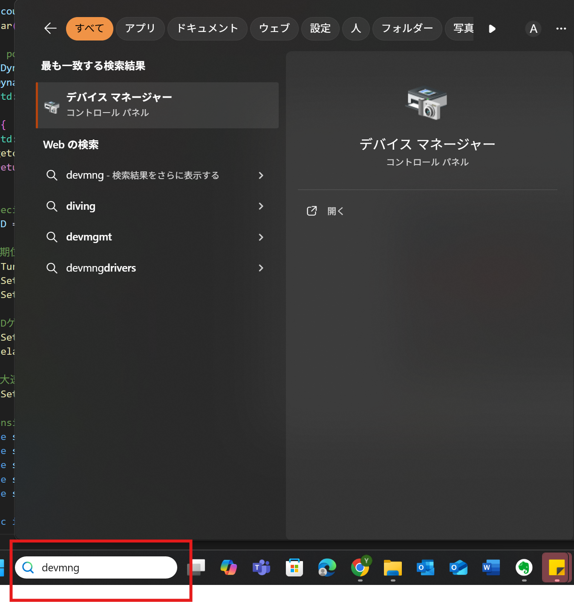

# kyoyoZemi2025

ダイナミクセルMx28を動かすためのサンプルプログラムです．
Windowsで動かすことを想定しています．

## 事前準備
以下の2つのソフトウェアを入れてください．

### ダイナミクセルウィザード
こちらのサイトに従って，ダイナミクセルウィザードをインストールしてください．
このソフトを使えば，ダイナミクセルを簡単に動かすことができます．
https://emanual.robotis.com/docs/en/software/dynamixel/dynamixel_wizard2/

ソフトウェアの使い方などは，日本語だと以下のサイトがまとまっています．
https://www.besttechnology.co.jp/modules/knowledge/?DYNAMIXEL%20basic%20tutorial#q270593c

使い方は最小限は授業中に教えますので，インストールまでできればOKです．

### C++プログラミング環境

C++言語のプログラムを作成・実行できる環境を作ってください．やり方は問いません．
このページでは，VS Code＋GCC with MinGWというやり方を紹介します．

以下の，マイクロソフトの公式サイトの案内に従ってVSCODEとMinGWをインストールしてください．
https://code.visualstudio.com/docs/cpp/config-mingw
（Prerequisites，Installing the MinGW-w64 toolchain，Check your MinGW installation　の3つの節をやってください）


## ダイナミクセルを動かすためのハードウェアの準備

ＵＳＢダイナミクセルをＰＣに接続してください
そして，ダイナミクセルに電源を与えてください．


## プログラムの実行
### 実行前の確認作業
ダイナミクセルと通信するポートが何番かを確かめます．
図のように，windows下部にある検索枠に，`devmng` と打ち込みます．すると，「デバイスマネージャー」が見つかりますので，それをクリックしてデバイスマネージャを立ち上げてください．



> [!NOTE]
> デバイスマネージャは，PCに接続されているデバイスを管理するマネージャです．USB接続の機器など接続すればここに出てきますので，ＰＣにデバイスを挿しても認識しない場合などはこれを確認すると良いです．


さて，デバイスマネージャを立ち上げると以下のような画面が出てきます．
下にスクロールしていって，「ポート（COMとLPT）」を探して，左側の「＞」印を押して内部の階層が見えるようにしてください．
「USBSerialPort（COM？）」というのが出てくると思います．このCOM番号を覚えておいてください．図の場合はCOM5です．
（複数ポートが出てくるときは，USBダイナミクセルを抜いて消えるポートを確認するなどして，どれがUSBダイナミクセルに対応しているかを特定してください．）


> [!NOTE]
> ダイナミクセルを動かすためには，ＰＣから指令を送る必要があります．この指令の通信には，シリアル通信と呼ばれる規格を使っています．
> この通信を行う際には，ポート番号（データの出入り口番号）を指定して通信してやる必要があります．

さらに，PCとダイナミクセルとの通信速度を上げるための設定をします．下の図のように，
1. 「USBSerialPort（COM？）」をダブルクリック
1. 出てくるウインドウ「USBSerialPort（COM？）のプロパティ」で，「ポートの設定」　タブを選択
2. 出てくるタブで，「詳細設定」　のボタンをクリック
3. 出てくるウインドウ「ＣＯＭ？の詳細設定」において，「待ち時間（ｍｓｅｃ）」を　「　１６　」　＝＞「　１　」に変更する．


> [!NOTE]
> デフォルトでは，パソコンの処理量を減らすため，得た通信データをバッファ（入れ物）にためて１６ｍｓおきに取り出すようになっています．つまり，ダイナミクセルとの通信に１６ｍｓの遅れが発生します．
> ダイナミクセルをなるべく遅延なく動かすために，この待ち時間を１ｍｓに変更する処理をしました．

### 実行前の準備
このリポジトリに上がっているプログラム一式をダウンロードして，実行する準備をします．
まず，このリポジトリ一式をダウンロードします．以下のように，このサイトの右上の緑ボタンを開いて，ZIPファイルでダウンロードするのが簡単です．


そのあと，フォルダを解凍して，codeフォルダの中身をすべて，自分のパソコン内にフォルダを作っておいてください．
ここでは，写真の例では，SampleDyna　というフォルダ内部にすべてのファイルを置きました．（写真では関係ないファイルも入っていますが，気にしないでください）


次に，プログラムファイルを開いて，自分のPCに合わせた設定をします（通信ポートやダイナミクセルＩＤなど）．

visual stdio code  を使って，プログラムファイルを開いてみましょう．
visual stdio code　を開いて，左上の　ファイルー＞フォルダを開く　から，先ほど作ったフォルダを開きます．
そうすると左側にエクスプローラが表示されて，フォルダ内のファイル等が出てきます．

まず，main_test_commSpeed.cppをダブルクリックして開きます．
ファイルを開いたら，以下の場所を修正します（図も参考に）
- １４行目の，`"\\\\.\\COM?"` の部分を，確認した通信ポートの番号に変更します． 例　`"\\\\.\\COM3"`
- ２５行目の　`int ID = ?` の部分で，？に，ダイナミクセルのＩＤ番号を入れてください（シールを張ってます）．　例　`int ID =  12`

これらの修正が出来たら，ファイルを上書き保存します．
左上の　ファイルー＞保存　をクリックするか，ショートカットキー　Ctr + s で保存しましょう．


同様に，main_test_ctrLoop.cppを開きます．ダブルクリックすると，VisualStudioCodeで開けると思います．
ファイルを開いたら，以下の図の場所を修正します（図も参考に）
- １４行目の，`"\\\\.\\COM?"` の部分を，確認した通信ポートの番号に変更します． 例　`"\\\\.\\COM3"`
- ２５行目の　`int ID = ?` の部分で，？に，ダイナミクセルのＩＤ番号を入れてください（シールを張ってます）．　例　`int ID =  12`

これらの修正が出来たら，同様にファイルを上書き保存します．


これで準備は完了です．
> [!NOTE]
> .cpp という拡張子は初めてみると思いますが，これが，C＋＋言語で書かれたプログラムの拡張子です．
> .h という拡張子のファイルもあります．基本的には　.cpp　ファイルにプログラム本体がかかれており，.h　ファイルには関数（一連の作業がまとめて書かれてある）などが定義されています．

### 通信のテストプログラムのコンパイルと実行
プログラムをコンパイルして動かします．
> [!NOTE]
> コンパイルというのは，人間に読める言語で書かれたプログラムを，PCで実行するための機械語に翻訳する作業と思ってください．
> プログラム言語の文法が間違っていたりすると，コンパイルエラーが出ます．プログラムファイルを修正するたびにコンパイルが必要です．

VisualStudioCodeの上の部分から，「ターミナル」と書かれた部分を選択して，「新しいターミナル」をクリックします．すると，下側にウインドウが増えると思います．　
その部分に，以下のコマンドをコピペして，エンターボタンを押してください．

```bash
g++ -o testComm.exe  main_test_commSpeed.cpp  serial.cpp  amBasic.cpp  -lstdc++
```

図のように，特にエラーがでることなく次の行が出てこれば成功です．
うまくいけば，左側のエクスプローラに，`testComm.exe` というファイルができていると思います．


> [!NOTE]
> ターミナルとは，PCに文字で指示を行うためのプログラムです．windows では コマンドプロンプト　とも呼ばれます．
> ここでは， g++ を使って，main_test_commSpeed.cpp  serial.cpp  amBasic.cpp　のファイルをコンパイルして，testComm.exe　という実行ファイルを作ってというコマンドを手打ちしました．
> また，.exe　ファイルは実行ファイルと呼ばれ，これをダブルクリックするとＰＣ内部で，プログラムに書いた処理が行われます．

さて，実行ファイルを実行してみましょう．
実行の仕方は２つあります．簡単なやり方は，フォルダ内にある　testComm.exe　をダブルクリックすれば実行できます（VisualStudioCodeのエクスプローラでダブルクリックするのではだめで，いわゆるファイルエクスプローラ（フォルダを開いて）からダブルクリックしてください．）
もう一つのやり方は，ターミナルで以下のコマンドを打つことです．
```bash
./testComm.exe
```
`./`が実行してください　というコマンドに対応しています．

実行してやると，
`Start program for checking dynamixel movement`
と表示されるので，エンターキーを押してください．
ポート番号が正常に設定できていれば，`Success to Open port`と表示され，１５秒後にダイナミクセルが動き始めます．
１秒おきに，ダイナミクセルの現在角度や，１００回の通信にかかった時間などが表示されると思います．

ここまでうまくできていれば，以下のような結果が出てくると思います．
ダイナミクセルのシャフト角度が左右に周期的に行ったり来たりしていること，通信時間が 100ms 程度であることを確認してください．


> [!WARNING]
> `Fail to Open port`と表示された場合は，通信ポート番号が間違っているか，USBが抜けた可能性があります．
> `Success to Open port`と表示されたけどダイナミクセルが動かない場合は，プログラムファイルに書いたダイナミクセルのIDが間違っている可能性があります．また，ダイナミクセルに電源が来ていないかもしれません．

プログラムを止める際は，ターミナルを選択して，Ctr + c とうってください．

### 制御サンプルプログラムのコンパイルと実行
いよいよ，ダイナミクセルを制御するためのサンプルプログラムを動かしてみます．

先ほど用意したターミナルで，以下のコマンドを売ってください．
```bash
g++ -o testCtr.exe  main_test_ctrLoop.cpp  serial.cpp  amBasic.cpp  -lstdc++
```
エラーが出なければ，左側のエクスプローラに，`testCtr.exe` というファイルができていると思います．

> [!NOTE]
> 今回は， g++ を使って，main_test_ctrLoop.cpp  serial.cpp  amBasic.cpp　のファイルをコンパイルして，testCtr.exe　という実行ファイルを作ってというコマンドを手打ちしました．
> 前回と違う点は，`main_test_ctrLoop.cpp`　というプログラムファイルを指定した点です．のちに説明しますが，これがダイナミクセルを制御するためのサンプルプログラムになります．

できた実行ファイル　testCtr.exe　を好きな方法で実行してください．ターミナルだと以下のコマンドを打ってください．
```bash
./testCtr.exe
```

実行してやると，
`Start program for checking dynamixel movement`
と表示されるので，エンターキーを押してください．
`Success to Open port`と表示され，１５秒後にダイナミクセルが動き始めます．
ダイナミクセルのシャフトは，９０度の振幅で，２０秒周期で振動することになると思います．

また，以下のような表示が出てくると思います．


プログラムを止める際は，ターミナルを選択して，Ctr + c とうってください．

## 制御サンプルプログラムの説明

このプログラムを改良してもらえるように，それぞれのコードの中身を説明します．
ファイルがいっぱいあってわかりにくいと思いますが，重要なファイルは　 main_test_ctrLoop.cpp　のみです．

```main_test_ctrLoop.cpp
#include <iostream>
#include "Dynamixel_Mx_simple.hpp"

int main(){
	double prevTime = 0;
	int count = 0;

	std::cout << "Start program for checking dynamixel movement" << std::endl;
	getchar();

	//Set port 
	Mx28 Dyna((TCHAR*)"\\\\.\\COM4", 1000000);
	if (Dyna.is_open()) {
		std::cout << "Success to Open port" << std::endl;
	}
	else {
		std::cout << "Fail to Open port" << std::endl;
		getchar();
		return 0;
	}

	// specify ID
	int ID = 12;

	// 初期位置にゆっくり移動する
	Dyna.TurnOnLED(ID, 1);
	Dyna.SetSpeedRad(ID, 0.4);
	Dyna.SetGoalRad(ID, 0.);

	// PIDゲインを決める
	Dyna.SetPID(ID, 4., 0., 0.);
	am::delay_ms(15000);

	// 最大速度出せるようにする
	Dyna.SetSpeedRad(ID, 0);

	// sensing 値を格納する箱
	double s_angle = 0.;
	double s_omega = 0.;
	double s_load = 0.;
	double s_volt = 0.;
	double s_temp = 0.;

	static int ctrFreq = 100; //  100
	double omega = am::pi / 10.;
	double amp = 1. * am::pi / 2.;

	prevTime = am::get_system_time_kon();
	while (1) {
		count++;
		double time = count / (double)ctrFreq;
		// Command 送る
		//  安全のため，リミット付きの関数を使って下さい．リミット値入れるのを忘れずに
		Dyna.SetGoalRad_wLimit(ID, amp * sin(omega * time), -1.6, 1.6);

		// sensing する
		if (!Dyna.update(ID, s_angle, s_omega, s_load, s_volt, s_temp)) {
			std::cout << "Fail to update data" << std::endl;
		}

		if (count % 100 == 1) {
			std::cout << " Pos : " << s_angle << ", Spd : " << s_omega << std::endl;
			std::cout << " Load: " << s_load << ", Volt : " << s_volt << ", Tmp : " << s_temp << std::endl;
		}

		while( am::get_system_time_kon() - prevTime < 1000./ctrFreq){
			// wait for next command
		}
		prevTime = am::get_system_time_kon();
	}

	return 0;
}
```

### プログラムの概要

このプログラムは以下の処理を行います：

* 指定したCOMポートを用いてDynamixelモーターと接続します。
* モーターの初期位置を設定し、PIDゲインの設定を行います。
* モーターをサイン波に基づいて時々刻々と動作させます。
* 位置、速度、負荷、電圧、温度のデータを取得し、出力します。

それぞれ順に内容を説明していきます．

### **ヘッダーファイルとライブラリのインクルード**

```cpp
#include <iostream>
#include "Dynamixel_Mx_simple.hpp"
```

この部分はおまじないと思ってもらっても構いません．やっていることとしては，
* `#include <iostream>`： 標準の入出力機能を提供するC++ライブラリ。
* `#include "Dynamixel_Mx_simple.hpp"`： Dynamixelの制御ライブラリをインクルード。Dynamixelとの通信や制御に必要な関数が含まれています。
  

### **メイン関数と初期変数の設定**

```cpp
int main(){
    double prevTime = 0;
    int count = 0;
```

`int main(){中身}` でくくられた内部に，プログラムを書きます．これはメイン関数と呼ばれます．
関数が何かは分かっていなくて大丈夫です．とにかく，この中にプログラムを書くと思ってください．

次に，変数が定義されています．`double` と `int` でデータ型を指定して，その後に変数の名前，初期値が書いてあります．
`double`型には実数を入れることができ， `int`型には整数を入れることができます．

* `prevTime`： 制御ループを決まった時間間隔で回すために，前回の時間を記録する変数　（単位は ms）
* `count`： 制御ループの回数をカウントする変数 


### **ユーザー入力とポート設定**

```cpp
std::cout << "Start program for checking dynamixel movement" << std::endl;
getchar();
```
* `std::cout << "Start program for checking dynamixel movement" << std::endl;` 
では，<<  << で囲まれた部分をターミナルに表示することができます．
* `getchar();`
では，キー入力を待機します。エンターが押されてから次に進むようにしています．


```cpp
Mx28 Dyna((TCHAR*)"\\.\COM4", 1000000);
```
ここでは，ダイナミクセル制御用の関数（厳密にはクラス Mx28　Dyna）を使って，通信条件を設定しています．
* `(TCHAR*)"\\.\COM4"`： 使用するCOMポートを指定
* `1000000`： 通信のボーレート（速度）を指定


### **モーターの初期化とPID設定**
この部分では，モータを初期位置にゆっくり動かすとともに，モータを制御するゲインの大きさを決定します．

```cpp
int ID = 12;
```
* 制御対象のモーターIDを `12` に設定。

```cpp
Dyna.TurnOnLED(ID, 1);
```
* モーターのLEDを点灯させる関数を読んでいます．
* `Dyna.TurnOnLED(ID, 0)` と打てば，LEDは消灯します．

> [!NOTE]
> ここで，関数という概念が出てきました．高校の時に倣った，$z = f(x, y)$ のように，関数ｆに引数を入れて呼び出すことができます．関数ｆは別途定義されていて，引数に合わせて適切な処理をしてくれます．
> ここでは，引数としてＩＤ，と　１／０（ＯＮ／ＯＦＦ）を引いており，ＩＤのダイナミクセルのＬＥＤをＯＮ/ＯＦＦします．

```cpp
Dyna.SetSpeedRad(ID, 0.4);
Dyna.SetGoalRad(ID, 0.);
```
ここでも，ダイナミクセル用の関数を使って，初期位置にゆっくり戻るように指令します．
* `SetSpeedRad(ID, 0.4)`： 速度を0.4ラジアン/秒に設定。
* `SetGoalRad(ID, 0.)`： モーターに0ラジアンの位置を指令。

```cpp
Dyna.SetPID(ID, 4., 0., 0.);
```
動かすときのＰＩＤゲインを設定します．
* PIDゲインの設定：
  * 比例ゲイン (P) = 4.0
  * 積分ゲイン (I) = 0.0
  * 微分ゲイン (D) = 0.0

```cpp
am::delay_ms(15000);
```
* 15秒間待機し、モーターが初期位置に到達する時間を確保。
* １５０００ｍｓは１５秒です．

```cpp
Dyna.SetSpeedRad(ID, 0);
```
* 速度を0に設定し直します．
* この場合，モーターは最大速度で動作します．

### **センサーデータの初期化**

```cpp
double s_angle = 0.;
...
```

* センサーから取得するデータ用の変数を初期化：

  * `s_angle`： 角度 rad
  * `s_omega`： 角速度 rad/s
  * `s_load`： 負荷 %
  * `s_volt`： 電圧 V
  * `s_temp`： 温度 deg


### **制御パラメータの設定とコマンド送信**

```cpp
static int ctrFreq = 100;
...
```

* `ctrFreq`： 制御ループの周波数を100Hzに設定。
* `omega`： サイン波の周波数（ラジアン/秒）。
* `amp`： サイン波の振幅。
なお，am::pi は，円周率　３．１４１５．．．です．

```cpp
prevTime = am::get_system_time_kon();
```
* 制御ループ開始時刻を取得。

### **制御ループの実行**
> [!IMPORTANT]
> この中身が重要な内容になります．

```cpp
while (1) {
```
* この中に書いたものが無限に繰り返されます．
* 無限ループで，モータへの角度指令を送り続けます．

```cpp
count++;
double time = count / (double)ctrFreq;
```
* 現在時刻ｔｉｍｅを計算します
* count が，ループの呼ばれた回数に対応しているので，制御周波数で割ることで時間 time[s]が分かります．

```cpp
Dyna.SetGoalRad_wLimit(ID, amp * sin(omega * time), -1.6, 1.6);
```
* サイン波コマンドを用いて目標角度を設定。
  *  目標角度 [rad]  ＝　amp [rad] ×　sin　(omega [rad/s] × time [s] )
* `-1.6` と `1.6` は可動範囲の下限と上限値［ｒａｄ］です

### **データ収集と出力**

```cpp
if (!Dyna.update(ID, s_angle, s_omega, s_load, s_volt, s_temp)) {
```

* センサーデータを取得し、更新。
* 取得に失敗した場合はエラーメッセージを出力。

```cpp
if (count % 100 == 1) {
    std::cout << " Pos : " << s_angle << ", Spd : " << s_omega << std::endl;
}
```

* 100回に1回の頻度でセンサーデータを出力。

### **制御ループの同期化**

```cpp
while( am::get_system_time_kon() - prevTime < 1000./ctrFreq){
```

* ループが一定の周波数で実行されるように時間待ちをしています．1000./ctrFreq　ｍｓ　待っています．


### **プログラムの終了**

このプログラムには終了条件が設定されていないため、手動で終了させる必要があります。

---

## やってみよう

**ダイナミクセルの角度が，±４５度の範囲を，周波数２Ｈｚで正弦波で振動するようにプログラムを改良して実行してみてください．**

> [!NOTE]
> プログラム上で，振幅 amp と角速度 omega の値を適切に変えてみましょう．
> プログラムを修正したあとは，ファイルを保存して，コンパイルして，実行し直すのを忘れないでください．

> [!TIP]
> 保存コマンド　Ｃｔｒ＋ｓ
> コンパイルは，ターミナル上で，
> ```bash
> g++ -o testCtr.exe  main_test_ctrLoop.cpp  serial.cpp  amBasic.cpp  -lstdc++
> ```
> できた実行ファイル　testCtr.exe　を実行するには，ターミナルだと以下のコマンドを打ってください．
> ```bash
> ./testCtr.exe
> ```

